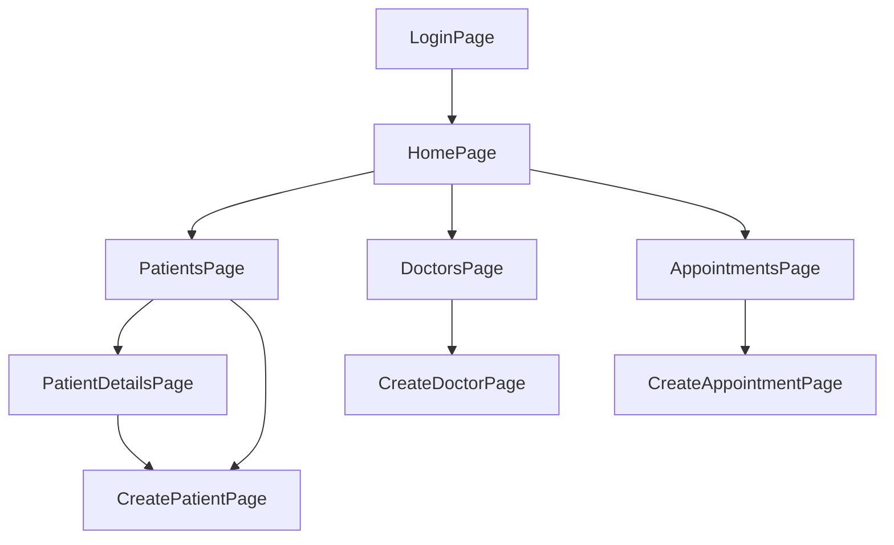
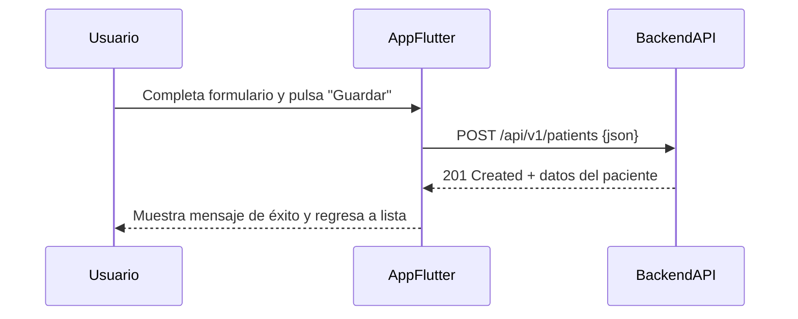

# Documentación de Screens - SACM Flutter (Detallada)

Este documento describe en profundidad cada pantalla (screen) de la aplicación SACM, su propósito, flujos de navegación, lógica principal, ejemplos de uso, diagramas y relaciones entre componentes.

---


## Índice
- [Diagrama General de Navegación](#diagrama-general-de-navegación)
- [HomePage](#homepage)
- [LoginPage](#loginpage)
- [PatientsPage](#patientspage)
- [PatientDetailsPage](#patientdetailspage)
- [CreatePatientPage](#createpatientpage)
- [DoctorsPage](#doctorspage)
- [CreateDoctorPage](#createdoctorpage)
- [AppointmentsPage](#appointmentspage)
- [CreateAppointmentPage](#createappointmentpage)

---


## Diagrama General de Navegación



---

## Diagrama de Casos de Uso (Simplificado)

```mermaid
  usecaseDiagram
    actor Admin
    actor Doctor
    actor Paciente
    Admin --> (Gestionar Pacientes)
    Admin --> (Gestionar Doctores)
    Admin --> (Gestionar Citas)
    Doctor --> (Ver Citas)
    Doctor --> (Ver Pacientes)
    Paciente --> (Ver Citas)
    Paciente --> (Solicitar Cita)
```

---

## Ejemplo de Secuencia: Crear Paciente



---

## Ejemplo de Payloads de API

### Crear Paciente (POST /api/v1/patients)
```json
{
  "fullName": "Juan Pérez",
  "email": "juan.perez@email.com",
  "documentId": "12345678"
}
```

### Respuesta exitosa
```json
{
  "id": 1,
  "fullName": "Juan Pérez",
  "email": "juan.perez@email.com",
  "documentId": "12345678"
}
```

### Crear Cita (POST /api/v1/appointments)
```json
{
  "patientId": 1,
  "doctorId": 2,
  "startAt": "2025-10-05T10:00:00Z",
  "endAt": "2025-10-05T10:30:00Z",
  "notes": "Consulta de control"
}
```

### Respuesta exitosa
```json
{
  "id": 10,
  "patientId": 1,
  "doctorId": 2,
  "startAt": "2025-10-05T10:00:00Z",
  "endAt": "2025-10-05T10:30:00Z",
  "notes": "Consulta de control"
}
```

---


## HomePage
**Archivo:** `lib/screens/home_page.dart`

- **Propósito:** Pantalla principal tras el login. Verifica conectividad a internet y estado de la API antes de permitir navegación.
- **¿Qué llama?**
  - Llama a `ApiService.get('/actuator/health')` para verificar el backend.
  - Navega a las pantallas de pacientes, doctores y citas.
- **¿Quién la llama?**
  - Es llamada desde `LoginPage` tras autenticación exitosa.
- **Ejemplo de uso:**
  ```dart
  Navigator.pushReplacementNamed(context, '/home');
  ```
- **Funcionamiento:**
  - Usa `connectivity_plus` para verificar internet.
  - Si la API responde, habilita la navegación.
  - Si falla, muestra error y bloquea navegación.

---


## LoginPage
**Archivo:** `lib/screens/login_page.dart`

- **Propósito:** Autenticación de usuario.
- **¿Qué llama?**
  - (Comentado) Llama a endpoint de login y guarda token en `flutter_secure_storage`.
  - Navega a `HomePage` tras login exitoso.
- **¿Quién la llama?**
  - Es la pantalla inicial de la app.
- **Ejemplo de uso:**
  ```dart
  Navigator.pushReplacementNamed(context, '/home');
  ```
- **Funcionamiento:**
  - Valida formulario.
  - (Listo para conectar a backend real).

---


## PatientsPage
**Archivo:** `lib/screens/patients_page.dart`

- **Propósito:** Listado y gestión de pacientes.
- **¿Qué llama?**
  - Llama a `ApiService.get('/api/v1/patients')` para obtener pacientes.
  - Llama a `ApiService.delete('/api/v1/patients/{id}')` para eliminar.
  - Navega a `PatientDetailsPage` y `CreatePatientPage`.
- **¿Quién la llama?**
  - Es llamada desde `HomePage`.
- **Ejemplo de uso:**
  ```dart
  Navigator.pushNamed(context, '/patients');
  ```
- **Funcionamiento:**
  - Usa `setState` para refrescar la UI.
  - Maneja carga, error y refresco tras CRUD.

---


## PatientDetailsPage
**Archivo:** `lib/screens/patient_details_page.dart`

- **Propósito:** Mostrar información detallada de un paciente.
- **¿Qué llama?**
  - Llama a `http.get('/api/v1/patients/{id}')` para obtener detalles.
  - Puede navegar a `CreatePatientPage` para editar.
- **¿Quién la llama?**
  - Es llamada desde `PatientsPage`.
- **Ejemplo de uso:**
  ```dart
  Navigator.pushNamed(context, '/patient_details', arguments: {'patientId': id});
  ```
- **Funcionamiento:**
  - Muestra datos completos y maneja errores.

---


## CreatePatientPage
**Archivo:** `lib/screens/create_patient_page.dart`

- **Propósito:** Crear o editar pacientes.
- **¿Qué llama?**
  - Llama a `http.post('/api/v1/patients')` para crear.
  - Llama a `http.put('/api/v1/patients/{id}')` para actualizar.
- **¿Quién la llama?**
  - Es llamada desde `PatientsPage` o `PatientDetailsPage`.
- **Ejemplo de uso:**
  ```dart
  Navigator.pushNamed(context, '/create_patient', arguments: paciente);
  ```
- **Funcionamiento:**
  - Usa formulario con validación y maneja estados de carga/error.

---


## DoctorsPage
**Archivo:** `lib/screens/doctors_page.dart`

- **Propósito:** Listado y gestión de doctores.
- **¿Qué llama?**
  - Llama a `ApiService.get('/api/v1/doctors')` para obtener doctores.
  - Navega a `CreateDoctorPage`.
- **¿Quién la llama?**
  - Es llamada desde `HomePage`.
- **Ejemplo de uso:**
  ```dart
  Navigator.pushNamed(context, '/doctors');
  ```
- **Funcionamiento:**
  - Refresca la UI tras operaciones y maneja errores.

---


## CreateDoctorPage
**Archivo:** `lib/screens/create_doctor_page.dart`

- **Propósito:** Crear o editar doctores.
- **¿Qué llama?**
  - (Simulado) Llama a función de creación/edición de doctor.
- **¿Quién la llama?**
  - Es llamada desde `DoctorsPage`.
- **Ejemplo de uso:**
  ```dart
  Navigator.pushNamed(context, '/create_doctor', arguments: doctor);
  ```
- **Funcionamiento:**
  - Usa formulario y simula la creación/edición.

---


## AppointmentsPage
**Archivo:** `lib/screens/appointments_page.dart`

- **Propósito:** Listado de citas médicas.
- **¿Qué llama?**
  - Llama a endpoint de citas (ajustar según API real).
  - Navega a `CreateAppointmentPage`.
- **¿Quién la llama?**
  - Es llamada desde `HomePage`.
- **Ejemplo de uso:**
  ```dart
  Navigator.pushNamed(context, '/appointments');
  ```
- **Funcionamiento:**
  - Muestra citas, maneja carga y errores.

---


## CreateAppointmentPage
**Archivo:** `lib/screens/create_appointment_page.dart`

- **Propósito:** Crear nuevas citas médicas.
- **¿Qué llama?**
  - Llama a endpoint de creación de citas.
  - Consulta listas de pacientes y doctores.
- **¿Quién la llama?**
  - Es llamada desde `AppointmentsPage`.
- **Ejemplo de uso:**
  ```dart
  Navigator.pushNamed(context, '/create_appointment');
  ```
- **Funcionamiento:**
  - Permite seleccionar paciente, doctor, especialidad, fecha y notas.

---


---

> **Nota:** Todos los endpoints y flujos pueden adaptarse según la evolución del backend y los requerimientos del sistema.
