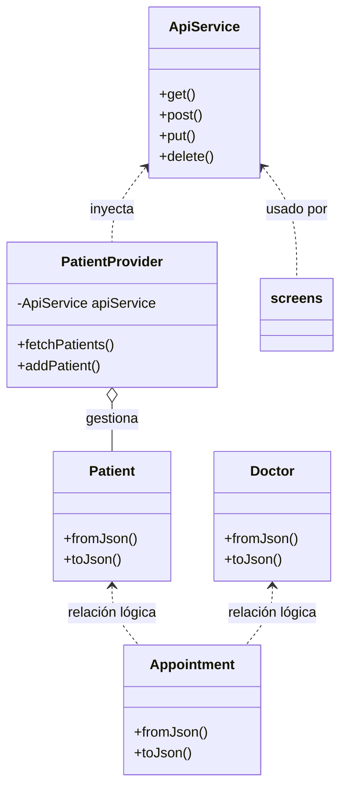
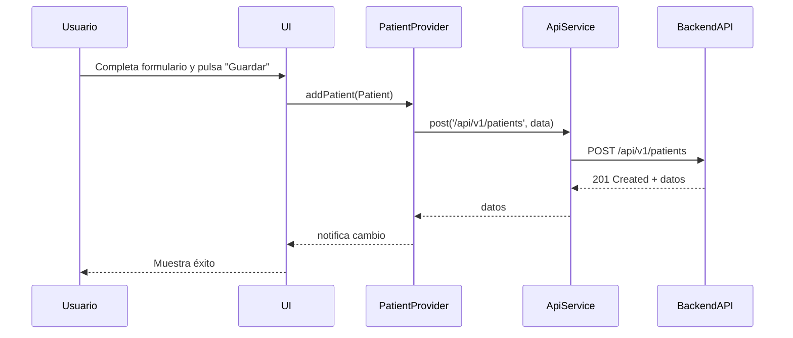

# Documentación de Services, Providers y Models - SACM Flutter (Detallada)

Este documento describe la estructura, propósito, ejemplos de uso, diagramas y relaciones de los servicios, providers y modelos de la app.

---


## Índice
- [Diagrama de Relaciones](#diagrama-de-relaciones)
- [Diagrama de Secuencia: Alta de Paciente](#diagrama-de-secuencia-alta-de-paciente)
- [Ejemplos de Payloads de API](#ejemplos-de-payloads-de-api)
- [Services](#services)
  - [ApiService](#apiservice)
- [Providers](#providers)
  - [PatientProvider](#patientprovider)
- [Models](#models)
  - [Patient](#patient)
  - [Doctor](#doctor)
  - [Appointment](#appointment)
  - [AuthResponse](#authresponse)

---

## Diagrama de Relaciones



---

## Diagrama de Secuencia: Alta de Paciente



---

## Ejemplos de Payloads de API

### Crear Paciente (POST /api/v1/patients)
```json
{
  "fullName": "Juan Pérez",
  "email": "juan.perez@email.com",
  "documentId": "12345678"
}
```

### Respuesta exitosa
```json
{
  "id": 1,
  "fullName": "Juan Pérez",
  "email": "juan.perez@email.com",
  "documentId": "12345678"
}
```

### Crear Cita (POST /api/v1/appointments)
```json
{
  "patientId": 1,
  "doctorId": 2,
  "startAt": "2025-10-05T10:00:00Z",
  "endAt": "2025-10-05T10:30:00Z",
  "notes": "Consulta de control"
}
```

### Respuesta exitosa
```json
{
  "id": 10,
  "patientId": 1,
  "doctorId": 2,
  "startAt": "2025-10-05T10:00:00Z",
  "endAt": "2025-10-05T10:30:00Z",
  "notes": "Consulta de control"
}
```

---

## Services

### ApiService
**Archivo:** `lib/services/api_service.dart`

- **Propósito:** Abstrae las llamadas HTTP al backend (GET, POST, PUT, DELETE) y maneja la serialización/deserialización de datos.
- **Métodos principales:**
  - `get(String endpoint)`
  - `post(String endpoint, Map<String, dynamic> data)`
  - `put(String endpoint, Map<String, dynamic> data)`
  - `delete(String endpoint)`
- **Ejemplo de uso:**
  ```dart
  final api = ApiService(baseUrl: 'http://3.142.93.102:8085');
  final pacientes = await api.get('/api/v1/patients');
  ```
- **Relaciones:** Usado por screens y providers para acceder a la API.

---

## Providers

### PatientProvider
**Archivo:** `lib/providers/patient_provider.dart`

- **Propósito:** Gestiona el estado reactivo de la lista de pacientes y notifica a la UI cuando hay cambios.
- **Métodos principales:**
  - `fetchPatients()`
  - `addPatient(Patient patient)`
- **Ejemplo de uso:**
  ```dart
  final provider = PatientProvider(apiService: api);
  await provider.fetchPatients();
  print(provider.patients);
  ```
- **Relaciones:** Usado por screens para obtener y modificar pacientes de forma reactiva.

---

## Models

### Patient
**Archivo:** `lib/models/patient.dart`

- **Propósito:** Representa la entidad paciente.
- **Campos:** `id`, `fullName`, `documentId`, `email`
- **Métodos:**
  - `Patient.fromJson(Map<String, dynamic> json)`
  - `toJson()`
- **Ejemplo de uso:**
  ```dart
  final p = Patient.fromJson(json);
  print(p.fullName);
  ```

### Doctor
**Archivo:** `lib/models/doctor.dart`

- **Propósito:** Representa la entidad doctor.
- **Campos:** `id`, `fullName`, `specialty`
- **Métodos:**
  - `Doctor.fromJson(Map<String, dynamic> json)`
  - `toJson()`
- **Ejemplo de uso:**
  ```dart
  final d = Doctor.fromJson(json);
  print(d.specialty);
  ```

### Appointment
**Archivo:** `lib/models/appointment.dart`

- **Propósito:** Representa una cita médica.
- **Campos:** `id`, `doctorId`, `patientId`, `startAt`, `endAt`, `status`, `paymentStatus`, `notes`
- **Métodos:**
  - `Appointment.fromJson(Map<String, dynamic> json)`
  - `toJson()`
- **Ejemplo de uso:**
  ```dart
  final a = Appointment.fromJson(json);
  print(a.startAt);
  ```

### AuthResponse
**Archivo:** `lib/models/auth_response.dart`

- **Propósito:** Modelo para la respuesta de autenticación (token JWT).
- **Campos:** `token`
- **Métodos:**
  - `AuthResponse.fromJson(Map<String, dynamic> json)`
  - `toJson()`
- **Ejemplo de uso:**
  ```dart
  final auth = AuthResponse.fromJson(json);
  print(auth.token);
  ```

---

> **Nota:** Todos los modelos implementan métodos de serialización para facilitar la integración con la API REST.
